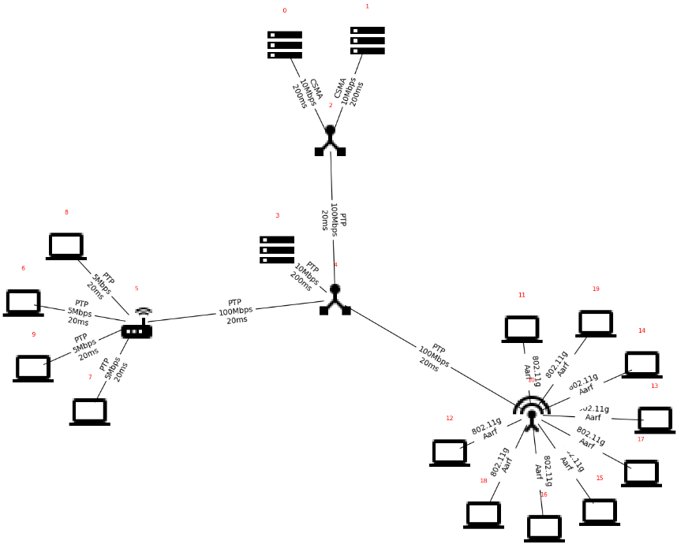
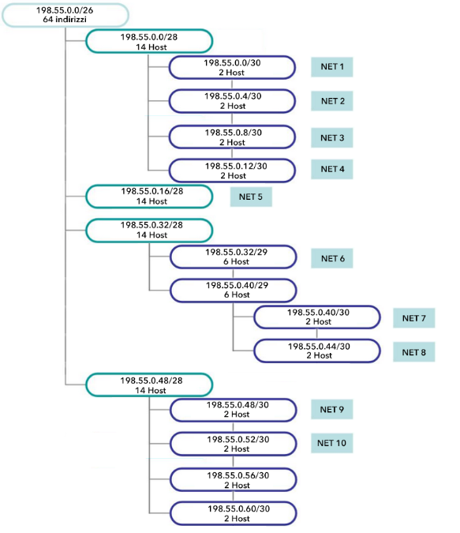
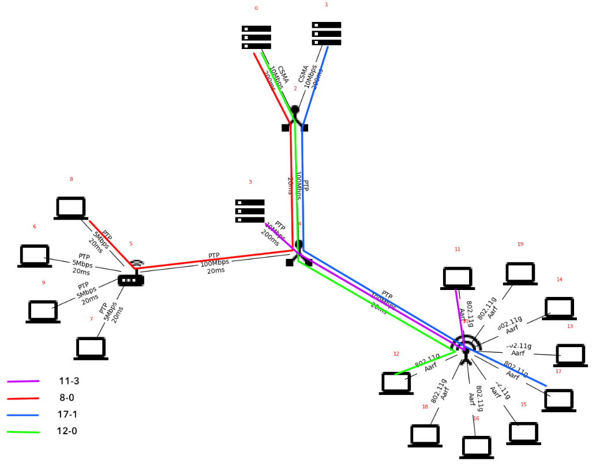
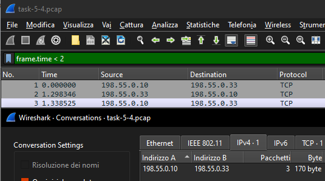
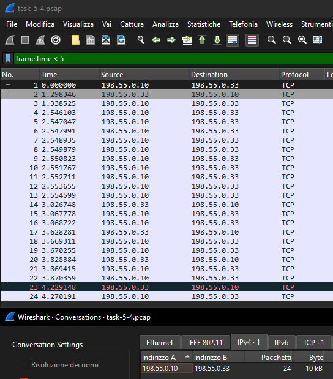
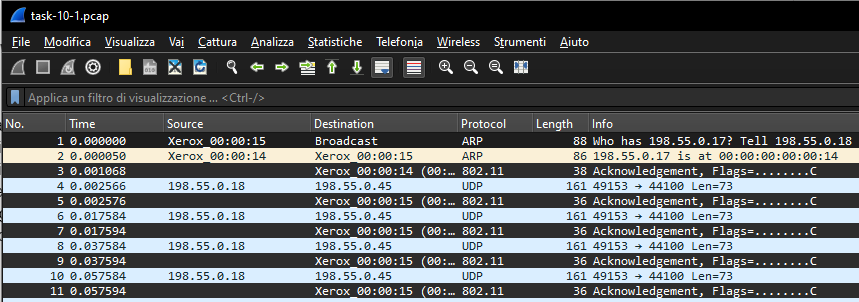
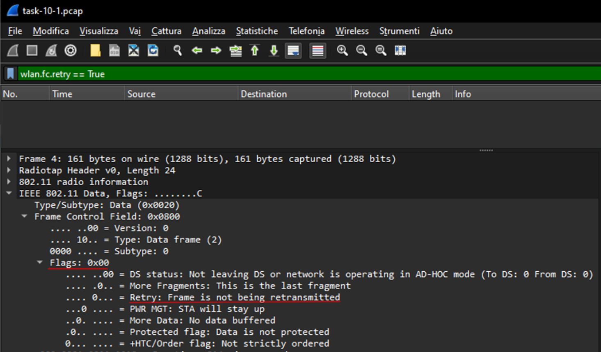
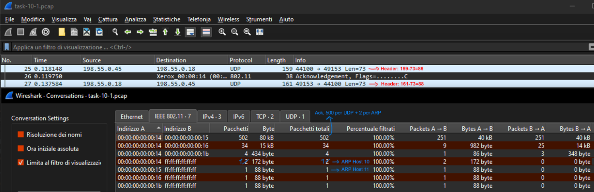

# Report Homework 2

## Creazione della rete

TCP burst traffic of 1615 B for each packet starting at 0.49 s 
&nbsp;&nbsp;&nbsp;&nbsp;Sender: Node 8&nbsp;&nbsp;&nbsp;&nbsp;Receiver: Server 0 
TCP burst traffic of 1900 B for each packet starting at 3.83 s 
&nbsp;&nbsp;&nbsp;&nbsp;Sender: Node 17&nbsp;&nbsp;&nbsp;&nbsp;Receiver: Server 1 
TCP burst traffic of 1946 B for each packet starting at 3.45 s 
&nbsp;&nbsp;&nbsp;&nbsp;Sender: Node 12&nbsp;&nbsp;&nbsp;&nbsp;Receiver: Server 0 
Wi-Fi operating in Ad Hoc mode, stationary devices, no random walk 
UDP Echo application with Client 11 and Server 3 
&nbsp;&nbsp;&nbsp;&nbsp;Size of packet:2037 Bytes   Periodicity:20ms 	MaxPackets: 250

Abbiamo deciso di creare 10 sottoreti VLSM a partire dall’indirizzo 198.55.0.0/26. Contando le interfacce di rete siamo giunti alla conclusione che ci servono 49 indirizzi, perciò sono sufficienti 6 bit host. Tutti i collegamenti PTP che si collegano all’interfaccia del router 5 (esclusa quella verso il router 4\) sono stati considerati come una singola sottorete. Questa sottorete ha a sua volta 4 sottoreti, una per ciascun PTP. Mentre i restanti collegamenti PTP sono delle sottoreti indipendenti. I nodi 0, 1 e un’interfaccia del 2 formano un’altra sottorete. I nodi collegati al router WiFi formano l’ultima sottorete. Per realizzare i TCP burst traffic abbiamo installato delle On Off Application nei nodi sorgenti con target gli indirizzi dei server destinatari in cui abbiamo aperto determinate porte per la comunicazione TCP. 

## Topologia e ritardi di rete

1\. La struttura generale è un albero, la cui radice è il router 4\. Le sottoreti che coinvolgono il router 5 formano una topologia a stella dove gli spoke sono i laptop 6-7-8-9. I server 0 e 1 formano con il router 2 una topologia a bus. Invece è difficile definire una topologia specifica per la rete Wi-fi Ad Hoc, dato che dipende da una serie di fattori come la distanza che va a determinare la visibilità che ha un nodo all'altro e viceversa.

2\. Per ricostruire il percorso dei pacchetti nella rete abbiamo abilitato il tracciamento nei dispositivi 10, 4, 5 e 2\. In particolare i collegamenti PTP tra 4-10, 4-5, 4-2. Abbiamo abilitato questi tracciamenti perché se un pacchetto deve attraversare la rete, avrà bisogno di passare attraverso questi collegamenti. Prendiamo come caso di studio la comunicazione tra l’host 8 e il server 0, che hanno come indirizzi IP rispettivamente 198.55.0.10/30 e 198.55.0.33/29, usiamo il filtro *ip.addr \== 198.55.0.10 and ip.addr \== 198.55.0.33* nelle interfacce 4-5 e 4-2. In questo modo notiamo che i pacchetti saranno gli stessi in tutte e due le interfacce. Procedendo allo stesso modo per le comunicazioni tra il nodo 17 e il server 1, tra il nodo 17 e il server 0 e infine per la Echo Application tra client 11 e server 3\. Per la prima e la seconda vediamo che passano nei link 10-4 e 4-2 e viceversa per gli ack. La Echo Application passa per 10-4 e il PTP 4-3. 

3\. Nella rete ci sono diversi collegamenti bottleneck come quelli con un data rate notevolmente più basso rispetto a quello tra router. Cioè i collegamenti tra i laptop e il router 5, i server sia con il router 4 che 2\. Per il wifi le criticità possono essere causate invece dalla distanza tra i singoli nodi e dal protocollo usato. Può essere migliorato utilizzando uno standard più recente come il 802.11n. Tramite l’analisi del traffico, abbiamo notato come il nodo 0 prenda tutta la banda disponibile nella sottorete CSMA, rendendo il nodo 1 irraggiungibile. La topologia di rete bus provoca una bottleneck causata dalla strategia di servizio offerta dal canale, dove viene servito un solo host alla volta con una politica FIFO. Per i collegamenti PTP c’è poco che si può fare se non migliorare i collegamenti per aumentare il data rate e ridurre i ritardi. Mentre per i server 0 e 1 si dovrebbe cambiare la topologia di rete con collegamenti diretti con il router 2, con ad esempio PTP prestazionali.

4\. Il throughput medio è dato dal numero di bit ricevuti da un nodo diviso un dato tempo non istantaneo. Calcoliamo il throughput medio nei vari collegamenti che partono dall’host 8 e arrivano al server 0\. Questo perché il resto dei flussi non sono attivi in quanto non sono partite altre comunicazioni (escludendo la Echo Application). Abbiamo notato che in tutti i collegamenti abbiamo lo stesso numero di pacchetti nei primi 2 secondi, cioè 3 pacchetti relativi all’handshake a 3 vie. Per vedere la dimensione totale dei pacchetti siamo andati in Statistiche/Conversazioni/IPv4. Il throughput medio è di 680 bit/s. Per catturare i primi 2 secondi abbiamo messo come filtro *frame.time \< 2*. Si è scelto come filtro *frame.time* invece di *frame.time\_relative* perché il primo calcola il tempo assoluto dall’inizio della simulazione mentre il secondo si basa sul tempo relativo all’invio del primo frame sul collegamento che si sta monitorando. 

5\. Si è scelto di monitorare solamente i collegamenti tra router perché racchiudono tutto il traffico della rete. In particolare i collegamenti che monitoriamo sono tra router 4-2, 4-5, 4-10. Tra 4-5 abbiamo solo 2 flussi di dati, uno che parte dall’host 8 e arriva al server 0 e viceversa per gli ack. Il throughput medio è di 16768 bit/s. Tra 4-10 possiamo avere 6 flussi dati, cioè 2 flussi UDP e 4 flussi TCP (considerando anche i flussi di ack). Il throughput è di 185 bit/s. Nel calcolo abbiamo escluso i flussi UDP con il filtro *not udp*. Infine tra 4-2 possiamo avere 6 flussi TCP relativi a 3 comunicazioni TCP con un throughput di 16864 bit/s, che è la somma dei precedenti throughput. Possiamo notare che in 4-10 sono presenti solamente 2 pacchetti SYN TCP appartenenti a due host WiFi che tentano una connessione con i server 0 e 1 fallendo a causa della monopolizzazione della rete CSMA da parte dell’host 8\. Infatti la maggior parte del throughput tra 4-2 appartiene all’host 8\.

## Rete Wireless Ad Hoc

1\. Tutti i frame ricevono l’acknowledgement. Questo perché è previsto dal protocollo MAC di 802.11\[1\]. I progettisti scelsero di utilizzare il protocollo CSMA/CA. Per evitare le collisioni si usa lo scheda di avvenuta ricezione a livello di collegamento (ARQ). Se un frame non riceve un ack c’è stato un problema e viene ritrasmesso. Per essere precisi il protocollo 802.11e (2005) introduce i block acknowledgement che permettono di includere in un solo ack più frame. Noi usiamo il protocollo 802.11g, dove ancora non era stato introdotto. 

2\. Un frame WiFi ha un flag che segnala se si tratta di una ritrasmissione. Il flag si chiama Retry. Lo segna come attivo se il frame non riceve l’ack. Per verificare se questo flag è attivo, cioè si tratta di una ritrasmissione, applichiamo il filtro *wlan.fc.retry \== True* sul file task-10-1.pcap (rete WiFi). Nel nostro caso non ci sono state ritrasmissioni. Facendo dei test abbiamo messo come frequenza di trasmissione della Echo Application 1ms al posto di 20ms. In questo modo abbiamo trovato una serie di ritrasmissioni causate probabilmente dall’incremento del traffico.

3\. Per il calcolo dell’overhead della Echo Application abbiamo considerato il protocollo ARP iniziale, gli acknowledgement dei frame che ogni pacchetto riceve (protocollo 802.11) e l’header di ogni pacchetto. Il protocollo ARP prende 348 byte. Gli ack che l’host riceve pesano 36 byte mentre quelli che riceve il router 10 38 byte. Per vedere il numero di pacchetti UDP, abbiamo utilizzato la funzione di Wireshark Statistiche/Conversazioni/UDP. Nel nostro caso sono 500, ovvero 250 per parte. Quindi abbiamo in totale 502 ack. 2 in più rispetto ai pacchetti UDP per via degli ack relativi al protocollo ARP. In totale pesano 18574 byte. Infine gli header UDP occupano 88 e 86 byte, rispettivamente tra host-server e server-host per un totale di 43500 byte. L’intero overhead è di 62422\. Il payload totale ammonta a 36500 byte. Notiamo che l’overhead rappresenta quasi ⅔ dei byte scambiati (63%). 

4\. Anche forzando l’uso di RTS/CTS, non abbiamo collisioni. Nel caso del test della risposta 2\. dove abbiamo messo la frequenza di trasmissione della Echo Application a 1ms, le ritrasmissioni sono scomparse. Cioè non ci sono collisioni in quel caso. 

5\. Forzando l’uso di RTS CTS, ogni pacchetto UDP ha 44 o 42 byte di RTS e 36 o 38 byte di CTS, rispettivamente per host-server e server-host. Perciò l’overhead aumenterà di 40000 byte. In totale ammonta a 102422 byte, il 74% circa del totale dei byte scambiati. 